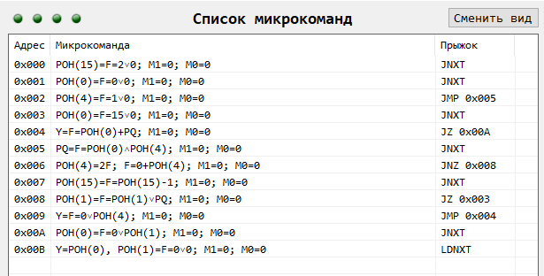

# АСВТ ЛР4
## Принцип работы
Загружаем обратный счетчик, загружаем число, загружаем начальную маску (Либо 0001, либо 1000, в зависимости от того, с какой стороны надо сохранять нули => какой сдвиг используется для маски на `0х6`). В цикле проверяем все разряды числа: Если в разряде 0 -> декрементируем счетчик, загружаем разряд в РОН(1); Если в разряде 1 -> загружаем разряд в РОН(1). В регистр с нашим начальным числом будет загружено число 15 (`1111`), когда обратный счетчик будет равен 0. Сделано так, потому что цикл будет продолжать пока не пройдет по всем разрядам числа, то есть пока маску сдвигами не сделает нулевой. Может быть такой случай, что лимит нулей исчерпан, а цикл проверки еще идет. Для этого число заменяем на `1111`, чтобы остальные разряды задать 1. После окончания цикла число из РОН(1) записывается в исходным РОН и выводится на Y.
## Описание микрокоманд
|**МК**| **Описание**|
|:-:|:-|
|0x0|Загружаем обратный счетчик (2 в РОН(15))|
|0x1|Загружаем число в РОН(0)|
|0x2|Загружаем начальную маску в РОН(4) (0001/1000)|
|0x3|Загружаем 1111 в РОН(0), когда обратный счетчик == 0|
|0x4|Ничего не делает, нужно для выхода из цикла в xA; Занимает отдельную микрокоманду, т.к. на x6 проверяется флаг Z с x5. Если поставить JZ на х5, то флаг не будет сохраняться. Проверяет флаг Z с шага х9.|
|0x5|Максируем число (ЧИСЛО х МАСКА), чтобы получить один разряд для проверки. Сохраняем разряд в PQ.|
|0x6|Сдвигаем маску и проверяем флаг Z с x5. х5 отвечает за получение разряда числа, то есть если разряд не 0, то мы перешагиваем через х7 сразу в х8.|
|0x7|Декремент счетчика РОН(15)|
|0x8|В РОН(1) добавляем разряд из PQ (шаг х5) и проверяем если флаг Z == 0; Если флаг Z == 0, то переходим на х3 (Лимит нулей исчерпан, грузим в РОН(0) 1111, т.к будет продолжать, пока маска != 0. Значит оставшиеся разряды нам надо задать 1.|
|0x9|Получает содержимое маски РОН(4) и переходит на х4. Если маска == 0 цикл закончится и произойдет переход из х4 в хА.|
|0xA|Сохраняет в начальный РОН(0) результат из РОН(1)|
|0xB|Очищает РОН(1), на выход подается содержимое РОН(0)|
## MTEMU
  

